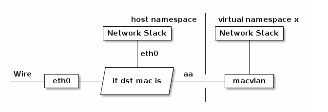

## Macvlan原理

- Macvlan是Linux内核支持的网络接口，要求Linux内核版本是v3.9以上。
- Macvlan有四种工作模式：Private、VEPA、Bridge和Passthru。最常用和默认的模式是Bridge模式。
- 通过为物理网卡创建Macvlan子接口，允许一块物理网卡拥有多个独立的MAC地址和IP地址。虚拟出来的子接口将直接暴露在底层物理网络中。
- 从外看，就像使用物理网络一样，分别接到了不同的主机上一样。物理网卡收到包后，会根据收到包的目的MAC地址判断这个包需要交给哪个虚拟网卡。



## Macvlan环境搭建

```bash
$ ip link set eth0 promisc on
$ mkdir -p /etc/cni/net.d
$ mkdir -p /opt/cni/bin
$ wget http://103.210.237.214/download/v1.9.5/cni-plugins-amd64-v0.7.0.tgz
$ tar zxf cni-plugins-amd64-v0.7.0.tgz -C /opt/cni/bin/
```

macvlan的配置文件/etc/cni/net.d/macvlan.conf内容：
```json
{
    "name": "k8s-pod-network",
    "cniVersion": "0.3.0",
    "type": "macvlan",
    "master":"eth0",
    "ipam": {
        "type": "host-local",
        "ranges": [
          [
            {
                "subnet": "172.16.129.0/24",
                "rangeStart": "172.16.129.110",
                "rangeEnd": "172.16.129.119",
                "gateway": "172.16.129.254"
            }
          ]
        ],
        "dataDir": "/run/my-orchestrator/container-ipam-state",
        "routes": [
            {"dst":"0.0.0.0/0"},
            {"dst":"172.16.129.0/24"}
        ]
    },
    "dns": {
        "nameservers": ["192.168.5.229","192.168.4.189"]
    }
}
```

- master的配置是宿主机对应的网卡，根据具体情况修改
- 采用`host-local`方式管理ip地址，你也可以使用dhcp方式，可参考[ipam](https://github.com/containernetworking/plugins/tree/master/plugins/ipam)
- dns的配置根据具体情况修改

修改/etc/kubernetes/kubelet的配置，添加cni的配置信息，其余配置不变，然后重启kubelet。

```bash
KUBELET_ARGS="--network-plugin=cni --cni-conf-dir=/etc/cni/net.d --cni-bin-dir=/opt/cni/bin ......" 
systemctl restart kubelet 
kubectl create -f yaml/nginx.yaml
```

## Macvlan验证

测试结果如下：
- 跨主机容器互通
- 同一宿主机的容器互通
- 容器和其他节点互通
- **容器和宿主机不互通**

在Macvlan下容器和宿主机默认不互通，是因为macvlan与eth0处于不同的namespace，拥有不同的network stack，被kernel的内核模块拦截了。要解决这个问题，需要在eth0上创建一个macvlan设备，将eth0的IP地址移到这个macvlan设备上，并修改默认的路由。**注意这个操作会造成网络断掉**

172.16.129.101/24是宿主机eth0的ip地址，操作如下：

```bash
$ ip route 
default via 172.16.129.254 dev eth0
169.254.0.0/16 dev eth0  scope link  metric 1002
172.16.129.0/24 dev eth0  proto kernel  scope link  src 172.16.129.101
172.30.47.0/24 dev docker0  proto kernel  scope link  src 172.30.47.1

$ ip link add link eth0 macvlan0 type macvlan mode bridge
$ ip link set dev macvlan0 up
$ ip addr add 172.16.129.101/24 dev macvlan0
$ route add -net 0.0.0.0 gw 172.16.129.254 dev macvlan0
$ route del -net 0.0.0.0 gw 172.16.129.254 dev eth0 

# 重新登陆宿主机，测试容器和宿主机的连通性，可以互通了
$ ping 172.16.129.115
PING 172.16.129.115 (172.16.129.115) 56(84) bytes of data.
64 bytes from 172.16.129.115: icmp_seq=1 ttl=64 time=0.067 ms
64 bytes from 172.16.129.115: icmp_seq=2 ttl=64 time=0.052 ms
64 bytes from 172.16.129.115: icmp_seq=3 ttl=64 time=0.055 ms
^C
--- 172.16.129.115 ping statistics ---
3 packets transmitted, 3 received, 0% packet loss, time 1999ms
rtt min/avg/max/mdev = 0.052/0.058/0.067/0.006 ms

$ ip route
default via 172.16.129.254 dev macvlan0
169.254.0.0/16 dev eth0  scope link  metric 1002
172.16.129.0/24 dev macvlan0  proto kernel  scope link  src 172.16.129.101
172.16.129.0/24 dev eth0  proto kernel  scope link  src 172.16.129.101
172.30.47.0/24 dev docker0  proto kernel  scope link  src 172.30.47.1
```

机器重启后上面的操作会失效，为了永久保存配置，可以将操作保存到/etc/rc.d/rc.local
```bash
$ cat /etc/rc.d/rc.local
......
ip link set eth0 promisc on
ip link add link eth0 macvlan0 type macvlan mode bridge
ip link set dev macvlan0 up
ip addr add 172.16.129.101/24 dev macvlan0

route add -net 0.0.0.0 gw 172.16.129.254 dev macvlan0
route del -net 0.0.0.0 gw 172.16.129.254 dev eth0

$ chmod u+x /etc/rc.d/rc.local
$ systemctl enable rc-local
```

## 参考文档

- [图解网络虚拟化](https://blog.csdn.net/dog250/article/details/45788279)
- [CNI plugins](https://github.com/containernetworking/plugins)
- [CNI Spec](https://github.com/containernetworking/cni/blob/master/SPEC.md#container-networking-interface-specification)
